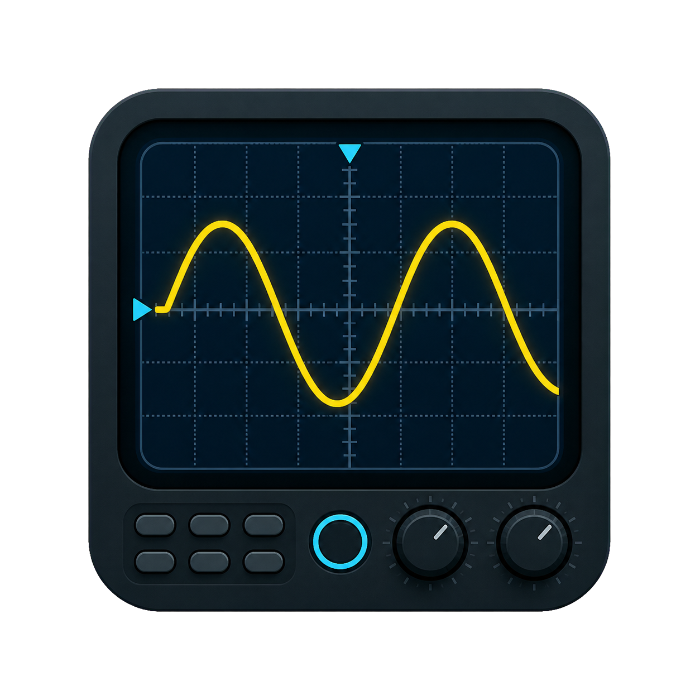

<p align="center">
  
</p>

<h1 align="center">OSC App</h1>

<p align="center">
  Visor y analizador de adquisiciones CSV y BIN de osciloscopios SIGLENT.
</p>

[](https://www.python.org/)
[](#estado-del-proyecto)

OSC App es una aplicación de escritorio para abrir capturas extensas, navegar como en un
osciloscopio y realizar mediciones sin modificar las muestras originales. El desarrollo actual
está enfocado en la familia SIGLENT SDS1xx4X-E/U.

> Importante: el lector BIN es experimental. Verifica mediciones críticas contra el instrumento
> o contra una exportación CSV oficial de la misma captura.

## Funciones actuales

- Importación de CSV con eje temporal explícito y hasta cuatro canales.
- Lectura experimental del BIN moderno SIGLENT de 8 bits.
- Detección de canales activos, escala, offset, sonda, tasa de muestreo y trigger.
- Capturas de hasta 14 Mpts verificadas con archivos reales.
- Zoom horizontal tipo `Time/div` con pasos 1–2–5.
- Zoom vertical mediante `Ctrl + rueda`, Auto Y y controles Y+/Y−.
- Visualización por picos o promedio visual.
- Activación individual de canales y modo `Solo`.
- Atenuación de sonda configurable por canal entre 0.01X y 1000X.
- Acoplamiento DC, AC centrado, AC filtrado e inversión de polaridad por canal.
- Cursores verticales X1/X2 y horizontales Y1/Y2, apagados al iniciar.
- Colocación guiada, movimiento fino y etiquetas Y desplazables.
- Región X1–X2 con estadísticas y valores por canal.
- Frecuencia automática y Duty+ mediante umbral medio e histéresis 40/60 %.
- Tablas superpuestas movibles para cursores, estadísticas y ciclo motor.
- Exportación PNG con las mediciones y superposiciones visibles.
- Señales de referencia CSV/BIN con alineación, ganancia, offset y transparencia.
- Offset visual independiente por canal, separación automática y restablecimiento,
  sin modificar las muestras ni las mediciones eléctricas.
- Etiquetas C1/C2/C3/C4 junto al eje Y: arrastre para desplazar el canal y doble
  clic para regresar su offset a cero. Doble clic con la rueda restaura la vista.
- Reglas X bloqueables, entrada numérica y hasta 32 particiones configurables.
- Mediciones de flancos, pulsos, subida, bajada, overshoot, retardo y fase.
- Seis pruebas automotrices guiadas con conexiones, preparación y seguridad.
- Canales matemáticos seguros: operaciones A/B, derivada, integral y filtros.
- Analizador FFT con ventanas, escala lineal/dB y conversión de pico a RPM.
- Decodificación UART 8-N-1 inicial con tabla hexadecimal y validación de parada.

## Análisis de ciclo motor

La referencia angular se define señalando primero `0°` y después `720°`. La aplicación:

- divide el ciclo en cuatro áreas de 180°;
- colorea Trabajo, Escape, Admisión y Compresión;
- permite escoger qué etapa comienza en 0°;
- convierte X1, X2 y ΔX de tiempo a grados;
- calcula duración del ciclo y RPM;
- incluye los resultados en una tabla superpuesta exportable.

`1/Δt` corresponde exclusivamente a la separación de X1 y X2. La frecuencia automática del
canal aparece como `Freq` en la tabla de estadísticas y las RPM se muestran en la tabla del ciclo.

## Compresímetro en PSI

El modo compresímetro convierte un canal de voltaje a presión mediante dos puntos de calibración:

```text
voltaje mínimo  → presión mínima
voltaje máximo  → presión máxima
```

También admite un factor adicional de corrección del sensor. Al activarlo, la gráfica, el eje
vertical, Y1/Y2 y las estadísticas del canal seleccionado se muestran en PSI.

El análisis del ciclo informa:

- presión mínima y máxima;
- ángulo donde aparece la presión máxima;
- presión máxima durante cada una de las cuatro etapas.

Ejemplo para un sensor de `0.5–4.5 V / 0–500 PSI`:

| Ajuste | Valor |
|---|---:|
| Voltaje mínimo | 0.5 V |
| Voltaje máximo | 4.5 V |
| Presión mínima | 0 PSI |
| Presión máxima | 500 PSI |
| Factor sensor | 1.0X |

La conversión no recorta valores fuera del rango configurado, lo que permite detectar sobrepasos
o errores de cero.

## Formatos compatibles

| Formato | Estado | Observaciones |
|---|---|---|
| CSV | Compatible | Tiempo explícito y columnas CH1–CH4 |
| SIGLENT BIN moderno de 8 bits | Experimental | Validado con cabecera `0x800` |
| SIGLENT BIN de 16 bits | Pendiente | Se rechaza de forma segura |
| BIN SIGLENT antiguo | Pendiente | Necesita un parser independiente |
| MATLAB/DAT | Pendiente | Planificado como importador adicional |

## Instalación para desarrollo

Requisitos: Windows 10/11 y Python 3.10 o superior.

```powershell
git clone https://github.com/C0d3Phys/siglent-osc.git
cd siglent-osc
python -m venv .venv
.\.venv\Scripts\Activate.ps1
python -m pip install --upgrade pip
python -m pip install -e ".[dev]"
```

## Ejecutar

```powershell
python -m osc_app
```

Después de la instalación también está disponible:

```powershell
osc-app
```

Usa **Archivo → Abrir adquisición** para seleccionar un archivo `.csv` o `.bin`.

## Controles principales

| Acción | Control |
|---|---|
| Acercar o alejar tiempo | Rueda sobre la gráfica |
| Acercar o alejar verticalmente | `Ctrl + rueda` |
| Colocar X1/X2 o Y1/Y2 | Activar el tipo de cursor y hacer dos clics |
| Mover cursores | Arrastrarlos después de colocarlos |
| Mover texto Y1/Y2 | Arrastrar solamente la etiqueta sobre su línea |
| Mover tablas superpuestas | Arrastrar la tabla con el botón izquierdo |
| Medir Freq y Duty+ | Consultar estadísticas; usa X1–X2 si la región está activa |
| Analizar ciclo motor | Pulsar `Marcar 0° y 720°` y señalar ambos puntos |
| Medir ángulos | Definir el ciclo y colocar X1/X2 |
| Cambiar la etapa inicial | Elegir la etapa que comienza en 0° |
| Medir presión | Configurar el sensor y activar `Mostrar y medir en PSI` |
| Corregir voltaje real | Ajustar `Sonda` en el panel de canales |
| Abrir menú de gráfica | Clic derecho sobre la gráfica |
| Guardar imagen | `Ctrl + S` |
| Abrir señal de referencia | `Herramientas → Abrir señal de referencia` |
| Seleccionar una referencia | `Ctrl + clic` sobre su trazo |
| Sincronizar una referencia seleccionada | `Ctrl + arrastrar` sobre la gráfica |
| Comparar matemáticamente con la referencia | `Herramientas → Comparar con referencia` |
| Crear canal matemático | `Herramientas → Crear canal matemático` |
| Analizar espectro | `Herramientas → Analizador FFT` |
| Decodificar UART | `Herramientas → Decodificación UART` |
| Abrir pruebas guiadas | `Análisis → Pruebas automotrices guiadas` |
| Abrir adquisición | `Ctrl + O` |

## CSV sintético para pruebas

```powershell
python -m osc_app.tools.generate_sample_csv examples/siglent_fake_4ch.csv
```

Con cantidad de muestras y tasa personalizadas:

```powershell
python -m osc_app.tools.generate_sample_csv examples/captura.csv --samples 100000 --sample-rate 1000000
```

Los BIN y las capturas de trabajo están excluidos por `.gitignore` para evitar publicar archivos
grandes o potencialmente privados. Los CSV sintéticos dentro de `examples/` sí pueden versionarse.

## Calidad y pruebas

Las comprobaciones se ejecutan localmente; el proyecto no utiliza GitHub Actions.

```powershell
python -m pytest
ruff check .
```

Actualmente existen 13 pruebas automatizadas para importación CSV/BIN, estadísticas, selección de
muestras, frecuencia y Duty+.

## Estructura

```text
siglent-osc/
├── docs/                  # Especificaciones y planificación
├── osc_app/
│   ├── app/               # Interfaz PySide6 y PyQtGraph
│   ├── core/              # Modelos, importadores y mediciones
│   ├── resources/         # Logo y recursos empaquetados
│   └── tools/             # Generadores y utilidades
├── tests/                 # Pruebas automatizadas
├── CONTRIBUTING.md
├── README.md
└── pyproject.toml
```

## Documentación

- [Índice de documentación](docs/README.md)
- [Especificación general del producto](docs/product-specification.md)
- [Especificación del MVP](docs/mvp-specification.md)
- [Plan de desarrollo](docs/development-plan.md)
- [Guía para contribuir](CONTRIBUTING.md)

## Estado del proyecto

El proyecto está en fase alpha. Las principales limitaciones actuales son:

- soporte experimental para una sola variante moderna del BIN de 8 bits;
- necesidad de validar más parejas BIN/CSV y más modelos SIGLENT;
- estadísticas de capturas grandes calculadas todavía en el hilo de la interfaz;
- ausencia de empaquetado `.exe`, proyectos persistentes, FFT y filtros;
- calibraciones del compresímetro todavía no se guardan entre sesiones.

## Colaboración

El repositorio público está disponible en
[github.com/C0d3Phys/siglent-osc](https://github.com/C0d3Phys/siglent-osc).
Antes de proponer cambios, consulta [CONTRIBUTING.md](CONTRIBUTING.md).

## Licencia

El proyecto todavía no declara una licencia de distribución. Hasta que se añada una licencia,
el código puede consultarse públicamente, pero no se concede automáticamente permiso para
redistribuirlo o crear trabajos derivados.
